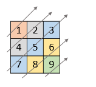

# 455. Assign Cookies

- See solution file [here](./solution.cpp)
- See solution notes [here](./455.%20Assign%20Cookies.pdf)

Given a 2D integer array nums, return all elements of nums in diagonal order as
shown in the below images.

### Example 1:

`Input:` nums = [[1,2,3],[4,5,6],[7,8,9]]  
`Output:` [1,4,2,7,5,3,8,6,9]

### Example 2:

`Input:` nums = [[1,2,3,4,5],[6,7],[8],[9,10,11],[12,13,14,15,16]]  
`Output:` [1,6,2,8,7,3,9,4,12,10,5,13,11,14,15,16]

### Constraints:

- 1 <= nums.length <= 105
- 1 <= nums[i].length <= 105
- 1 <= sum(nums[i].length) <= 105
- 1 <= nums[i][j] <= 105
